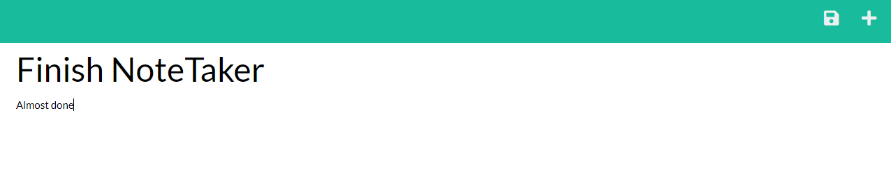
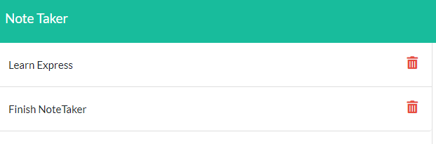

# NoteTaker

## Table of contents

1. [Description](#Description)
2. [Installation](#Instructions)
3. [Usage](#Usage)
4. [License](#License)
5. [Contribution](#Contribution)
6. [Tests](#Tests)
7. [Questions](#Questions)

## Description

A node based application that allows for efficient note management. By leveraging the power of nodejs and express, your users will be able to catologue, reference, save, and delete notes at will.

Notes are stored from previous session through the use of a JSON file.

Tools Used

1. Node.js
2. JavaScript
3. Express.js

Nodes Used

1. uniqid: Assigned unique id to each post request, which made subsequent routing possible. Note: I also had a lot of luck with NanoID.
2. bodyParser
3. fs
4. path

## Installation

Live Application Deployed to Heroku

Link:https://vast-headland-95939.herokuapp.com/notes

## Usage

1. Users are directed to a landing page
   

2. Once the users enter the notes page, they will either see notes from previous session, or placeholder text.
   

3. Users can save notes by clicking the disk icon in the top right hand of the screen. This will cause the notes to be rendered on the left hand side.
   

4. Users can either click on the rendered notes to display them in the main card, or click on the trash icon to remove them.

## License

None

## Contribution

Collaboration is always welcome, please feel free to fork this repository, improve upon it, and let me know your feedback.

## Tests

Jest is the preferred tool for unit testing.

## Questions

Got questions, or are interested in collaborating?

Github:https://github.com/lelandcypress

Email: souterm1@gmail.com
